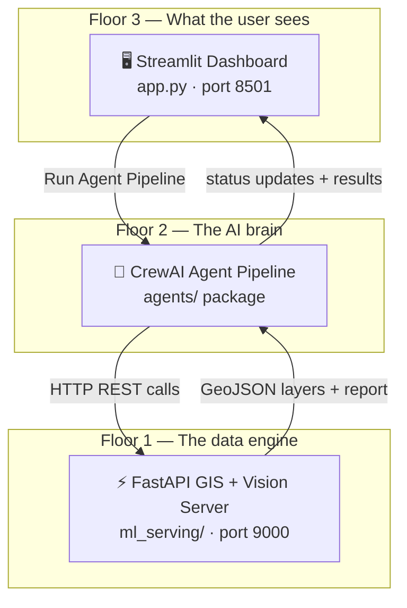
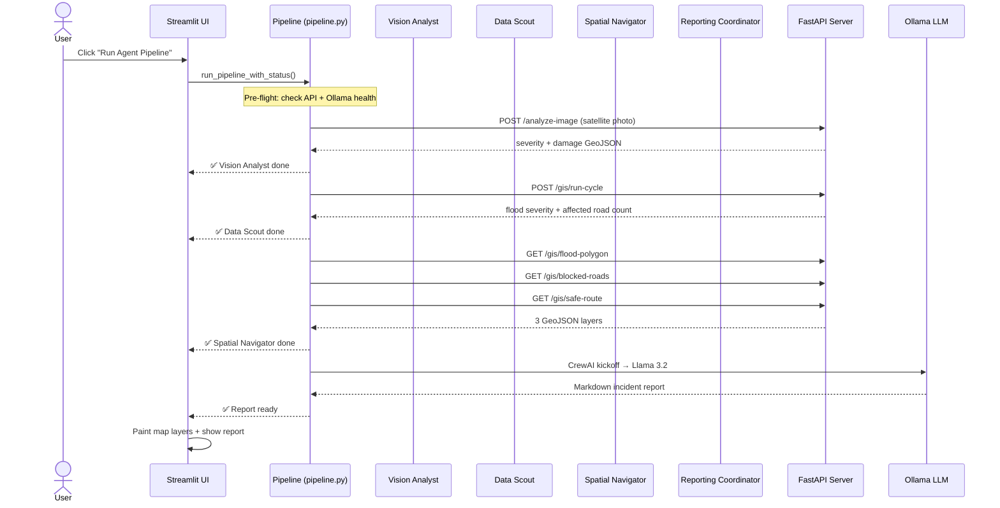
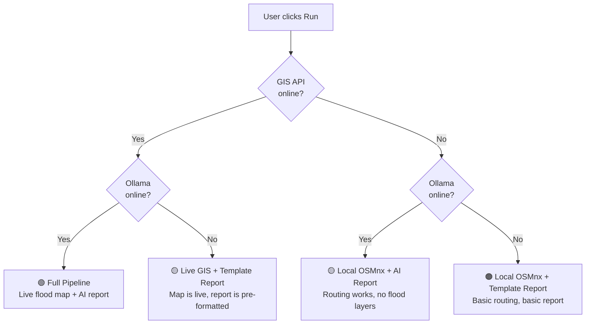

# GeoRescue Architecture — Plain-Language Walkthrough

## The 30-Second Pitch

GeoRescue is a **flood emergency command centre**. A responder types "Assess flood impact near Colombo Fort" → four AI agents wake up → one analyses a satellite photo, one fetches live rainfall, one figures out which roads are underwater, and one writes a report. The result is an interactive map with safe routes and a ready-to-print incident report. **All of that in one click.**

---

## The Three Layers

Think of the system as a **three-storey building**:

| Floor | What it does | Analogy |
|-------|-------------|---------|
| **Floor 3 — UI** | Shows the map, takes user input, displays the report | The cockpit / control room |
| **Floor 2 — Agents** | Coordinates four AI specialists in sequence | The mission commander giving orders |
| **Floor 1 — Backend** | Crunches weather data, analyses satellite images, computes routes | The lab / engine room |

---

## How a Mission Runs (Data Flow)

When you click **▶ Run Agent Pipeline**, here's exactly what happens:

### In plain English:

1. **Pre-flight** — The pipeline checks "Is the GIS server running? Is Ollama running?" and adapts its strategy accordingly.
2. **Step 1 (Vision Analyst)** — If you uploaded a satellite image, it gets sent to the **Qwen2-VL-7B** vision model running on the AMD GPU. The model looks at the image and says things like *"severity: high, flooding visible in south-west quadrant"*.
3. **Step 2 (Data Scout)** — Hits the GIS server which fetches **live rainfall data** from Open-Meteo, then generates a flood polygon scaled by how heavy the rain is.
4. **Step 3 (Spatial Navigator)** — Grabs three GeoJSON layers from the server: the flood polygon (blue zone on map), blocked roads (red lines), and the safe evacuation route (green line).
5. **Step 4 (Reporting Coordinator)** — Feeds everything to **Llama 3.2** via Ollama, which writes a structured emergency report with road names, distances, and recommended actions.
6. **Done** — The map updates with all layers, and the report appears below.

---

## The Four AI Agents

Each agent is a **CrewAI `Agent`** — essentially a persona with a goal, a backstory, and a set of tools it's allowed to use. They run **sequentially**: each one passes its findings to the next.

| # | Agent | Tools it uses | What it produces |
|---|-------|--------------|-----------------|
| ① | **Vision Analyst** | `POST /analyze-image` | Severity rating + damage zone GeoJSON from the satellite photo |
| ② | **Data Scout** | `check_api_health`, `run_gis_cycle`, `get_gis_status` | Flood severity level, affected road count, live weather snapshot |
| ③ | **Spatial Navigator** | `get_flood_polygon`, `get_blocked_roads`, `get_safe_route` | Three map layers (flood zone, blocked roads, safe route) |
| ④ | **Reporting Coordinator** | *(no tools — just the LLM)* | A formatted Markdown emergency report synthesising all findings |

> **Why not one big agent?** Because each agent has a narrow, well-defined job. The Data Scout doesn't need to know about routing, and the Navigator doesn't need to write reports. This makes the system more reliable and easier to debug.

---

## What Each File Does

### `agents/` — The AI Brain

| File | Role |
|------|------|
| [`crew.py`](georescue/agents/crew.py) | Defines the 3 CrewAI agents (Scout, Navigator, Coordinator), their personas, and their tasks. Builds the sequential crew and kicks it off. |
| [`tools.py`](georescue/agents/tools.py) | Thin HTTP wrappers (`@tool` decorated) that call the FastAPI server. Each tool handles errors gracefully so agents can self-correct. Also has `analyze_satellite_image()` for direct image uploads. |
| [`pipeline.py`](georescue/agents/pipeline.py) | The **master orchestrator**. Runs all 4 steps as a Python generator, yielding `AgentUpdate` objects so the UI can show live progress. Handles all fallback logic. |

### `georescue/` — The UI Package

| File | Role |
|------|------|
| [`config.py`](georescue/georescue/config.py) | Pydantic-powered settings — reads `.env` for API URLs, map defaults, speed assumptions. Single source of truth for configuration. |
| [`map_layers.py`](georescue/georescue/map_layers.py) | Folium layer builders: base map with 3 tile layers (OSM, Dark, Satellite), flood zone (blue), blocked roads (red), safe route (green), start/dest markers. |
| [`routing.py`](georescue/georescue/routing.py) | **Local-only routing** — downloads road graph from OpenStreetMap via OSMnx, removes edges inside hazard polygons, runs NetworkX shortest-path. Works entirely offline. |
| [`state.py`](georescue/georescue/state.py) | Streamlit `session_state` management — initialises all state variables (GeoJSON layers, route stats, agent logs, click coordinates). |

### `ml_serving/` — The Backend Engine

| Subdirectory | Role |
|-------------|------|
| `api/` | FastAPI routes: `/health`, `/analyze-image`, `/gis/run-cycle`, `/gis/flood-polygon`, `/gis/blocked-roads`, `/gis/safe-route` |
| `gis_pipeline/` | The real GIS work: `live_flood_feed.py` fetches Open-Meteo rainfall → `flood_overlay.py` generates the flood polygon and intersects it with roads → `routing.py` computes the safe route on the server side |
| `qwen_vl/` | Loads the **Qwen2-VL-7B** vision model with a LoRA adapter, processes satellite images, and extracts damage GeoJSON from the model's output |
| `training/` | LoRA fine-tuning scripts for the vision model on the AMD MI300X GPU |

### `app.py` — The Streamlit Entry Point

[`app.py`](georescue/app.py) is the **glue**. It:
- Sets up the sidebar (map config, layer toggles, agent log)
- Builds the left panel (mission prompt, routing points, action buttons)
- Builds the right panel (interactive Folium map with all layers)
- Wires the "Run Agent Pipeline" button to `run_pipeline_with_status()`
- Paints map layers from `session_state` after each run
- Shows the report + metadata panel at the bottom

---

## The Graceful Degradation Strategy

This is one of the smartest parts of the design. The app **never shows a blank screen** — it adapts to whatever services are available:

**How it works in code** ([`pipeline.py`](georescue/agents/pipeline.py)):
- Line 182: `api_ok = is_api_healthy()` — quick GET to `/health`
- Line 183: `llm_ok = _is_ollama_available()` — quick GET to Ollama's `/api/tags`
- The rest of the pipeline uses `if api_ok:` / `if llm_ok:` guards to decide what to do

When CrewAI itself crashes (e.g. Ollama times out mid-run), the pipeline catches the exception and falls back to `_build_template_report()` — a pre-structured report filled with whatever raw data it managed to collect.

---

## Key Design Decisions

| Decision | Why |
|----------|-----|
| **CrewAI with sequential process** | Each agent's output feeds the next. Parallel wouldn't work because the Navigator needs the Scout's flood data first. |
| **Vision handled outside CrewAI** | Image bytes can't be passed as string tool arguments in CrewAI. So `pipeline.py` calls the vision API directly, then passes the text findings into the crew. |
| **Two routing engines** | The FastAPI server has its own routing (`ml_serving/gis_pipeline/routing.py`), and the Streamlit app has a local one (`georescue/routing.py`). This means routing works even when the backend server is completely offline. |
| **Generator-based pipeline** | `run_pipeline_with_status()` is a Python generator (`yield`). This lets the UI update in real-time as each agent finishes, rather than waiting for the entire pipeline to complete. |
| **Cached road graph** | `@st.cache_resource` on `fetch_road_graph()` means the ~10 MB OpenStreetMap download only happens once per session. Subsequent route calculations reuse the cached graph instantly. |
| **HTTP retry with backoff** | `tools.py` uses `requests` with a `Retry` adapter (3 retries, 0.4s backoff, retry on 500/502/503/504). This handles transient server hiccups without failing the agent. |

---

## Technology Summary

| Layer | Technology | Purpose |
|-------|-----------|---------|
| UI | Streamlit + Folium | Interactive dashboard with live map |
| Agents | CrewAI + Ollama (Llama 3.2) | Multi-agent orchestration + reasoning |
| Vision | Qwen2-VL-7B + LoRA | Satellite image damage detection |
| GIS Backend | FastAPI + OSMnx + GeoPandas + NetworkX | Flood analysis + road overlay + routing |
| Weather | Open-Meteo API | Real-time precipitation data |
| GPU | AMD Instinct MI300X + ROCm | Hardware acceleration for vision model |
