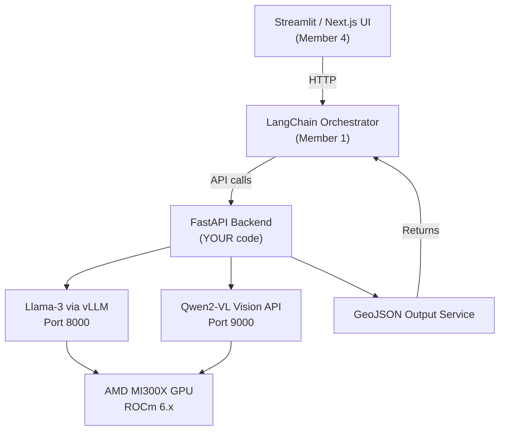

# 🧠 Member 3 — ML / Hardware Engineer: Full Implementation Plan

## GeoRescue: Autonomous Multi-Agent System for Disaster Intelligence & Routing

---

## 📋 Table of Contents

1. [Role Overview](#role-overview)
2. [Architecture Diagram](#architecture-diagram)
3. [Manual Steps (Things YOU Must Do By Hand)](#-manual-steps-you-must-do-by-hand)
4. [What You Get From Other Members](#-what-you-get-from-other-members)
5. [What You Provide TO Other Members](#-what-you-provide-to-other-members)
6. [Day-by-Day Implementation](#-day-by-day-implementation)
7. [Complete Code Templates](#-complete-code-templates)
8. [Risks & Mitigations](#-risks--mitigations)
9. [Final Checklist](#-final-checklist)

---

## Role Overview

You are the **AI Brain + GPU Backend** of GeoRescue. You build and serve the models that power disaster intelligence.

| Area | What You Own |
|------|-------------|
| **GPU Infra** | AMD MI300X instance, ROCm environment |
| **LLM Serving** | Llama 3 via vLLM (reasoning/orchestration) |
| **Vision AI** | Qwen2-VL (satellite image analysis) |
| **API Layer** | FastAPI endpoints for all AI services |
| **GeoJSON Output** | Flood/damage polygon generation |
| **Optimization** | Inference speed, memory, batching |
| **Benchmarks** | FPS, latency, GPU util metrics for demo |

---

## Architecture Diagram



---

## 🔴 Manual Steps (You MUST Do By Hand)

> [!CAUTION]
> These steps **cannot be automated** and require your manual action.

### 1. AMD Developer Cloud Account

| Step | Action |
|------|--------|
| 1 | Go to [https://devcloud.amd.com](https://devcloud.amd.com) |
| 2 | Create an account (use hackathon/team email) |
| 3 | Apply for credits — you may get **$100 free credits** via the AMD AI Developer Program |
| 4 | Generate an **SSH key pair** on your local machine and upload the public key |

```bash
# Generate SSH key locally
ssh-keygen -t ed25519 -C "georescue-hackathon"
# Copy the public key content to paste into AMD Cloud
cat ~/.ssh/id_ed25519.pub
```

### 2. Provision the GPU Instance

| Setting | Value |
|---------|-------|
| GPU | **MI300X** (single GPU is enough) |
| OS | Ubuntu 22.04 |
| Image | **Quick Start** (pre-installed ROCm + Docker) |
| RAM | 32+ GB |
| vCPUs | 8+ |

> [!TIP]
> Choose the **Quick Start image** — it comes with ROCm, Docker, and PyTorch pre-configured. This saves ~2 hours of manual setup.

### 3. Hugging Face Access Tokens

| Step | Action |
|------|--------|
| 1 | Go to [https://huggingface.co/settings/tokens](https://huggingface.co/settings/tokens) |
| 2 | Create a **Read** access token |
| 3 | Accept the license for `meta-llama/Meta-Llama-3-8B-Instruct` on HF |
| 4 | Accept the license for `Qwen/Qwen2-VL-7B-Instruct` on HF |
| 5 | Run `huggingface-cli login` on your GPU instance and paste the token |

### 4. Network/Firewall Configuration

You must **open ports** on your AMD instance:

| Port | Service |
|------|---------|
| 8000 | vLLM Llama-3 API |
| 9000 | FastAPI Vision + GeoJSON API |
| 22 | SSH access |

### 5. Share Endpoints With Team

Once services are running, share the **public IP + ports** with:
- **Member 1** (LangChain Orchestrator) — needs `http://<IP>:8000` and `http://<IP>:9000`
- **Member 4** (UI Developer) — needs `http://<IP>:9000` for image upload

---

## 📥 What You Get From Other Members

| From | What | Format | When You Need It |
|------|------|--------|-----------------|
| **Member 1** (LangChain) | Prompt templates for Llama 3 | JSON/string | Day 2-3 |
| **Member 1** (LangChain) | Agent tool definitions that call your APIs | Python code | Day 2-3 |
| **Member 2** (GIS) | Sample satellite images for testing | `.tif` / `.png` / `.jpg` | Day 1-2 |
| **Member 2** (GIS) | Coordinate reference system (CRS) info | EPSG code (e.g., 4326) | Day 2 |
| **Member 4** (UI) | Image upload format specification | multipart/form-data | Day 2 |
| **Member 4** (UI) | Expected API response format | JSON schema | Day 2 |

> [!IMPORTANT]
> **Ask Member 2 early (Day 1)** for 3-5 sample satellite images (flood, earthquake, normal). You need these to test Qwen-VL inference before integration.

---

## 📤 What You Provide TO Other Members

| To | What | Format |
|----|------|--------|
| **Member 1** | Llama-3 OpenAI-compatible endpoint | `POST http://<IP>:8000/v1/chat/completions` |
| **Member 1** | Vision analysis endpoint | `POST http://<IP>:9000/analyze-image` |
| **Member 1** | Health check endpoint | `GET http://<IP>:9000/health` |
| **Member 4** | Same API endpoints (for direct UI calls) | Same URLs |
| **All** | API documentation (auto-generated) | `http://<IP>:9000/docs` (Swagger UI) |
| **All** | Benchmark results for presentation | Markdown table / screenshots |

---

## 📅 Day-by-Day Implementation

### DAY 1 — AMD Infrastructure + Llama 3 Setup

**Goal:** GPU running, ROCm verified, Llama 3 serving via vLLM.

#### Step 1: SSH into Instance & Verify GPU

```bash
ssh root@<your-instance-ip>
rocm-smi
# Expected: GPU detected, temp, VRAM info
```

#### Step 2: Create Environment & Install Dependencies

```bash
sudo apt update && sudo apt install git wget python3-pip python3-venv -y
python3 -m venv georescue_env
source georescue_env/bin/activate

# Install ROCm PyTorch
pip install torch torchvision torchaudio --index-url https://download.pytorch.org/whl/rocm6.0

# Verify
python3 -c "import torch; print(torch.cuda.is_available())"  # → True
```

#### Step 3: Install & Launch vLLM

> [!TIP]
> **Docker method is recommended** over pip install for vLLM on ROCm — it handles all driver compatibility automatically.

**Option A — Docker (Recommended):**

```bash
docker pull rocm/vllm:latest

docker run -d --name llama-server \
  --network=host \
  --device=/dev/kfd \
  --device=/dev/dri \
  --group-add=video \
  --ipc=host \
  --cap-add=SYS_PTRACE \
  --security-opt seccomp=unconfined \
  --shm-size 8G \
  -e HF_TOKEN="<your-hf-token>" \
  rocm/vllm:latest \
  vllm serve meta-llama/Meta-Llama-3-8B-Instruct \
    --dtype float16 \
    --port 8000
```

**Option B — Pip Install:**

```bash
pip install vllm
python3 -m vllm.entrypoints.openai.api_server \
  --model meta-llama/Meta-Llama-3-8B-Instruct \
  --port 8000 &
```

#### Step 4: Test the API

```python
# test_api.py
from openai import OpenAI

client = OpenAI(base_url="http://localhost:8000/v1", api_key="EMPTY")

response = client.chat.completions.create(
    model="meta-llama/Meta-Llama-3-8B-Instruct",
    messages=[{"role": "user", "content": "What is flood risk assessment?"}]
)
print(response.choices[0].message.content)
```

#### Day 1 Deliverables

- [x] AMD GPU instance running
- [x] ROCm verified with `rocm-smi`
- [x] Llama-3 serving on port 8000
- [x] API test successful
- [x] Share endpoint URL with Member 1

---

### DAY 2 — Qwen-VL Vision AI + FastAPI

**Goal:** Vision model running, image analysis working, GeoJSON output, API serving.

#### Step 1: Install Vision Dependencies

```bash
pip install transformers accelerate pillow geojson
pip install qwen-vl-utils
pip install fastapi uvicorn python-multipart
```

#### Step 2: Build Vision Pipeline

Create the folder structure:

```bash
mkdir -p ml_serving/{llama_server,qwen_vl,api,benchmarks,docker}
```

> [!NOTE]
> See the [Complete Code Templates](#-complete-code-templates) section below for all file contents.

Key files to create:
1. `ml_serving/qwen_vl/model_loader.py` — Load Qwen2-VL
2. `ml_serving/qwen_vl/image_processor.py` — Preprocess satellite images
3. `ml_serving/qwen_vl/inference.py` — Run vision inference
4. `ml_serving/qwen_vl/geojson_generator.py` — Convert AI output → GeoJSON
5. `ml_serving/api/app.py` — FastAPI application
6. `ml_serving/api/routes.py` — API routes
7. `ml_serving/api/schemas.py` — Pydantic models

#### Step 3: Launch FastAPI

```bash
cd ml_serving
uvicorn api.app:app --host 0.0.0.0 --port 9000 --reload
```

#### Step 4: Test Vision Endpoint

```bash
curl -X POST http://localhost:9000/analyze-image \
  -F "file=@sample_flood.jpg" \
  -F "disaster_type=flood"
```

#### Day 2 Deliverables

- [x] Qwen-VL loaded and running
- [x] Image upload + analysis working
- [x] GeoJSON polygon output
- [x] FastAPI on port 9000
- [x] Swagger docs at `/docs`

---

### DAY 3 — Optimization + Integration

**Goal:** Connect with team, optimize performance, stress test.

#### Integration Tasks

| Task | With Whom | What To Do |
|------|-----------|-----------|
| LangChain → Llama API | Member 1 | Ensure prompts work, test tool calling |
| LangChain → Vision API | Member 1 | Test image analysis via agent |
| UI → Vision API | Member 4 | Test image upload from frontend |
| GeoJSON → Map | Member 2 | Validate GeoJSON renders on map |

#### Optimization Checklist

```bash
# 1. Enable fp16 quantization (already in vLLM --dtype float16)

# 2. Monitor GPU
watch -n 1 rocm-smi

# 3. Check memory
python3 -c "import torch; print(f'Allocated: {torch.cuda.memory_allocated()/1e9:.2f}GB')"
```

| Optimization | How |
|-------------|-----|
| **fp16 precision** | `--dtype float16` in vLLM |
| **Batching** | vLLM handles continuous batching automatically |
| **Image resize** | Resize to max 1024px before inference |
| **Async FastAPI** | Use `async def` for all endpoints |
| **Model warmup** | Load models at startup via `lifespan` |

#### Day 3 Deliverables

- [x] All APIs stable under concurrent load
- [x] Integration with Members 1, 2, 4 working
- [x] GPU memory optimized
- [x] Benchmark numbers collected

---

### DAY 4 — Polish + Presentation

**Goal:** Final validation, demo stats, presentation content.

#### Demo Statistics to Prepare

| Metric | Target | How to Measure |
|--------|--------|---------------|
| GPU | AMD MI300X | `rocm-smi` |
| LLM Speed | 100+ tok/s | vLLM logs |
| Vision Analysis | <5 sec/image | `latency_test.py` |
| Concurrent Requests | 10-20 | `throughput_test.py` |
| VRAM Usage | <60% | `rocm-smi` |

#### Presentation Talking Points

1. **Why AMD MI300X?** — 192GB HBM3, massive bandwidth, cost-effective for multi-model serving
2. **Why vLLM?** — Continuous batching, PagedAttention, OpenAI-compatible API
3. **Why Qwen-VL?** — Best open-source vision-language model for satellite understanding

---

## 📝 Complete Code Templates

### Folder Structure

```
ml_serving/
├── llama_server/
│   ├── start_llama.sh
│   ├── config.py
│   └── test_api.py
├── qwen_vl/
│   ├── model_loader.py
│   ├── image_processor.py
│   ├── inference.py
│   └── geojson_generator.py
├── api/
│   ├── app.py
│   ├── routes.py
│   └── schemas.py
├── benchmarks/
│   ├── gpu_stats.py
│   ├── latency_test.py
│   └── throughput_test.py
├── docker/
│   └── Dockerfile
└── requirements.txt
```

### `requirements.txt`

```
torch
torchvision
torchaudio
transformers
accelerate
qwen-vl-utils
pillow
geojson
fastapi
uvicorn
python-multipart
openai
pydantic
```

### `llama_server/start_llama.sh`

```bash
#!/bin/bash
# Start Llama-3 via vLLM with OpenAI-compatible API
export HF_TOKEN="${HF_TOKEN:-EMPTY}"

python3 -m vllm.entrypoints.openai.api_server \
  --model meta-llama/Meta-Llama-3-8B-Instruct \
  --dtype float16 \
  --port 8000 \
  --max-model-len 4096
```

### `llama_server/config.py`

```python
LLAMA_MODEL = "meta-llama/Meta-Llama-3-8B-Instruct"
LLAMA_PORT = 8000
LLAMA_BASE_URL = f"http://localhost:{LLAMA_PORT}/v1"
MAX_TOKENS = 2048
TEMPERATURE = 0.7
```

### `llama_server/test_api.py`

```python
from openai import OpenAI
from config import LLAMA_BASE_URL, LLAMA_MODEL

client = OpenAI(base_url=LLAMA_BASE_URL, api_key="EMPTY")

response = client.chat.completions.create(
    model=LLAMA_MODEL,
    messages=[
        {"role": "system", "content": "You are a disaster response AI assistant."},
        {"role": "user", "content": "Analyze flood risk for a low-lying coastal area."}
    ],
    max_tokens=512
)
print(response.choices[0].message.content)
```

### `qwen_vl/model_loader.py`

```python
import torch
from transformers import Qwen2VLForConditionalGeneration, AutoProcessor

MODEL_NAME = "Qwen/Qwen2-VL-7B-Instruct"
_model = None
_processor = None

def load_model():
    global _model, _processor
    if _model is None:
        print(f"Loading {MODEL_NAME}...")
        _model = Qwen2VLForConditionalGeneration.from_pretrained(
            MODEL_NAME, torch_dtype="auto", device_map="auto"
        )
        _processor = AutoProcessor.from_pretrained(MODEL_NAME)
        print("Model loaded successfully.")
    return _model, _processor
```

### `qwen_vl/image_processor.py`

```python
from PIL import Image
import io

MAX_SIZE = 1024  # Resize large satellite images to prevent OOM

def load_image(path_or_bytes):
    if isinstance(path_or_bytes, bytes):
        image = Image.open(io.BytesIO(path_or_bytes))
    else:
        image = Image.open(path_or_bytes)
    image = image.convert("RGB")
    # Resize if too large
    if max(image.size) > MAX_SIZE:
        image.thumbnail((MAX_SIZE, MAX_SIZE), Image.LANCZOS)
    return image
```

### `qwen_vl/inference.py`

```python
from qwen_vl.model_loader import load_model
from qwen_vl.image_processor import load_image
from qwen_vl_utils import process_vision_info

DISASTER_PROMPT = """Analyze this satellite/aerial disaster image. Identify:
1. Flooded areas (approximate bounding polygons as lat/lon coordinates)
2. Damaged roads or infrastructure
3. Collapsed or damaged buildings
4. Severity level (low/medium/high/critical)

Return a JSON object with keys: "severity", "findings", "affected_zones" 
(list of polygon coordinate arrays in [longitude, latitude] format)."""

def analyze_image(image_bytes: bytes, disaster_type: str = "flood"):
    model, processor = load_model()
    image = load_image(image_bytes)

    messages = [{"role": "user", "content": [
        {"type": "image", "image": image},
        {"type": "text", "text": DISASTER_PROMPT.replace("disaster", disaster_type)},
    ]}]

    text = processor.apply_chat_template(messages, tokenize=False, add_generation_prompt=True)
    image_inputs, video_inputs = process_vision_info(messages)
    inputs = processor(text=[text], images=image_inputs, videos=video_inputs,
                       padding=True, return_tensors="pt").to(model.device)

    output_ids = model.generate(**inputs, max_new_tokens=1024)
    output_text = processor.batch_decode(
        output_ids[:, inputs.input_ids.shape[1]:], skip_special_tokens=True
    )[0]
    return output_text
```

### `qwen_vl/geojson_generator.py`

```python
import json
import geojson

def parse_zones_to_geojson(ai_output: str, metadata: dict = None):
    """Convert AI text output into a valid GeoJSON FeatureCollection."""
    try:
        parsed = json.loads(ai_output)
        zones = parsed.get("affected_zones", [])
    except (json.JSONDecodeError, AttributeError):
        # Fallback: return empty collection if AI output isn't valid JSON
        return geojson.FeatureCollection([])

    features = []
    for i, zone_coords in enumerate(zones):
        # Ensure polygon is closed
        if zone_coords and zone_coords[0] != zone_coords[-1]:
            zone_coords.append(zone_coords[0])

        polygon = geojson.Polygon([zone_coords])
        feature = geojson.Feature(
            geometry=polygon,
            properties={
                "zone_id": i + 1,
                "severity": parsed.get("severity", "unknown"),
                "source": "qwen-vl-analysis",
                **(metadata or {})
            }
        )
        features.append(feature)

    return geojson.FeatureCollection(features)
```

### `api/schemas.py`

```python
from pydantic import BaseModel
from typing import Optional

class AnalysisResponse(BaseModel):
    status: str
    severity: Optional[str] = None
    findings: Optional[str] = None
    geojson: Optional[dict] = None
    inference_time_ms: Optional[float] = None

class HealthResponse(BaseModel):
    status: str
    llama_status: str
    qwen_status: str
    gpu_available: bool
```

### `api/app.py`

```python
from contextlib import asynccontextmanager
from fastapi import FastAPI
from api.routes import router

@asynccontextmanager
async def lifespan(app: FastAPI):
    # Warm up models at startup
    from qwen_vl.model_loader import load_model
    load_model()
    yield

app = FastAPI(
    title="GeoRescue AI API",
    description="Disaster intelligence powered by AMD MI300X",
    version="1.0.0",
    lifespan=lifespan
)
app.include_router(router)
```

### `api/routes.py`

```python
import time, torch
from fastapi import APIRouter, UploadFile, File, Form
from api.schemas import AnalysisResponse, HealthResponse
from qwen_vl.inference import analyze_image
from qwen_vl.geojson_generator import parse_zones_to_geojson

router = APIRouter()

@router.post("/analyze-image", response_model=AnalysisResponse)
async def analyze(file: UploadFile = File(...), disaster_type: str = Form("flood")):
    start = time.time()
    image_bytes = await file.read()
    ai_output = analyze_image(image_bytes, disaster_type)
    geojson_data = parse_zones_to_geojson(ai_output)
    elapsed = (time.time() - start) * 1000

    return AnalysisResponse(
        status="success",
        findings=ai_output,
        geojson=geojson_data,
        inference_time_ms=round(elapsed, 2)
    )

@router.get("/health", response_model=HealthResponse)
async def health():
    gpu_ok = torch.cuda.is_available()
    return HealthResponse(
        status="healthy", llama_status="running",
        qwen_status="running", gpu_available=gpu_ok
    )
```

### `benchmarks/latency_test.py`

```python
import time, requests

def test_llama_latency(base_url="http://localhost:8000/v1", n=5):
    from openai import OpenAI
    client = OpenAI(base_url=base_url, api_key="EMPTY")
    times = []
    for _ in range(n):
        start = time.time()
        client.chat.completions.create(
            model="meta-llama/Meta-Llama-3-8B-Instruct",
            messages=[{"role": "user", "content": "Describe flood evacuation steps."}],
            max_tokens=128
        )
        times.append(time.time() - start)
    avg = sum(times) / len(times)
    print(f"Llama-3 avg latency: {avg:.2f}s over {n} runs")

def test_vision_latency(api_url="http://localhost:9000", image_path="sample.jpg", n=3):
    times = []
    for _ in range(n):
        start = time.time()
        with open(image_path, "rb") as f:
            requests.post(f"{api_url}/analyze-image",
                          files={"file": f}, data={"disaster_type": "flood"})
        times.append(time.time() - start)
    avg = sum(times) / len(times)
    print(f"Vision avg latency: {avg:.2f}s over {n} runs")

if __name__ == "__main__":
    test_llama_latency()
    test_vision_latency()
```

### `docker/Dockerfile`

```dockerfile
FROM rocm/vllm:latest

WORKDIR /app
COPY requirements.txt .
RUN pip install -r requirements.txt

COPY . .

EXPOSE 8000 9000
CMD ["uvicorn", "api.app:app", "--host", "0.0.0.0", "--port", "9000"]
```

---

## 🛡 Risks & Mitigations

| Risk | Impact | Solution |
|------|--------|----------|
| ROCm driver incompatibility | GPU not detected | Use **Quick Start image** with pre-installed ROCm |
| GPU Out-of-Memory (OOM) | Model crash | Use `--dtype float16`, resize images to 1024px max |
| Slow inference | Demo looks bad | vLLM continuous batching + smaller context length |
| API timeout on large images | User sees error | Add `asyncio.Semaphore`, resize images, set timeout |
| Qwen-VL returns non-JSON text | GeoJSON fails | Fallback parser in `geojson_generator.py` (already included) |
| vLLM pip install fails on ROCm | Can't serve Llama | Use Docker image `rocm/vllm:latest` instead |
| HuggingFace rate limit | Can't download models | Download models once, cache in `/app/models` volume |

---

## ✅ Final Checklist

### Backend
- [ ] Llama-3 server responds on port 8000
- [ ] Qwen-VL inference works on port 9000
- [ ] `/analyze-image` returns valid GeoJSON
- [ ] `/health` returns status of all services
- [ ] No timeout issues under normal load

### GPU
- [ ] `rocm-smi` shows healthy GPU
- [ ] VRAM usage under 80%
- [ ] Inference latency within targets

### Integration
- [ ] Member 1 (LangChain) can call both APIs
- [ ] Member 4 (UI) can upload images and get results
- [ ] Member 2 (GIS) confirms GeoJSON is valid on map
- [ ] Swagger docs accessible at `/docs`

### Presentation
- [ ] Benchmark table with real numbers
- [ ] Screenshot of `rocm-smi` showing GPU utilization
- [ ] Demo video of end-to-end image → GeoJSON flow

---

## 🔗 Quick Reference: API Endpoints

```
# Llama-3 (OpenAI-compatible, served by vLLM)
POST http://<GPU-IP>:8000/v1/chat/completions

# Vision Analysis (your FastAPI)
POST http://<GPU-IP>:9000/analyze-image
  Body: multipart/form-data { file: <image>, disaster_type: "flood" }
  Returns: { status, severity, findings, geojson, inference_time_ms }

# Health Check
GET http://<GPU-IP>:9000/health
  Returns: { status, llama_status, qwen_status, gpu_available }

# Auto-generated API Docs
GET http://<GPU-IP>:9000/docs
```
